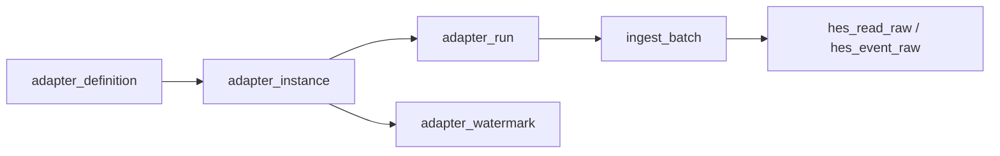

# Adapter Data Model

## Purpose

This document defines the proposed minimal persistent data model for runtime adapter management.

It focuses on:

- what adapter-related tables should exist first
- what fields belong in each table
- what should be stored vs derived
- how runtime adapter lineage should connect to the existing ingest model

## Why this document matters

The project already has:

- adapter profile concepts
- runtime lifecycle concepts
- operator action scope
- first polling baseline guidance

The next stable step is to define the minimum persistent model that supports those decisions without overbuilding.

If the data model is vague, implementation risks include:

- status logic duplicated in code rather than expressed in persistence
- no stable place for adapter history
- weak lineage between upstream collection and `ingest_batch`
- difficulty adding polling and operator controls later

## Core recommendation

The first runtime adapter persistence model should include four adapter-specific concepts:

- `adapter_definition`
- `adapter_instance`
- `adapter_run`
- `adapter_watermark`

In addition, the existing `ingest_batch` model should later gain optional lineage references back to runtime adapter execution.

Recommended minimal rule:

- store administrator intent
- store run history
- store incremental cursor state
- derive operator-facing effective status rather than persisting it directly

## Recommended top-level relationships

## Recommended tables

### 1. `adapter_definition`

Purpose:

- represent a code-backed adapter type or family
- separate reusable adapter type metadata from runtime instance configuration

Why keep it:

- avoids repeating implementation metadata on every instance
- allows operator-visible instance rows to stay focused on configuration and status
- supports future multiple instances of one adapter type

Recommended columns:

| Column | Type | Required | Notes |
| --- | --- | --- | --- |
| `id` | bigint PK | Yes | surrogate key |
| `adapter_code` | varchar(100) | Yes | stable machine-readable code, unique |
| `display_name` | varchar(150) | Yes | operator-friendly label |
| `delivery_mode` | varchar(20) | Yes | example: `poll`, `receive` |
| `source_family` | varchar(50) | Yes | example: `hes`, `vendor_api` |
| `record_type` | varchar(30) | Yes | example: `hes_read_raw` |
| `adapter_profile_key` | varchar(100) | No | example: `common_raw_v1` |
| `implementation_key` | varchar(100) | Yes | code-backed runtime implementation selector |
| `status` | varchar(30) | Yes | recommended: `active`, `inactive` |
| `description` | text | No | short operational explanation |
| `created_at` | timestamptz | Yes | standard timestamp |
| `updated_at` | timestamptz | Yes | standard timestamp |

Recommended constraints:

- unique on `adapter_code`

Recommended first use:

- seed this table from code-backed definitions
- do not require the operator to create new definitions in the first UI

### 2. `adapter_instance`

Purpose:

- represent one configured operational connection or source endpoint
- act as the main operator-managed object

Recommended columns:

| Column | Type | Required | Notes |
| --- | --- | --- | --- |
| `id` | bigint PK | Yes | surrogate key |
| `adapter_definition_id` | bigint FK | Yes | references `adapter_definition.id` |
| `instance_code` | varchar(100) | Yes | stable machine-readable instance key, unique |
| `display_name` | varchar(150) | Yes | operator-visible name |
| `source_system` | varchar(50) | Yes | should align with ingest `source_system` |
| `admin_state` | varchar(30) | Yes | recommended: `enabled`, `paused`, `retired` |
| `status_reason` | varchar(200) | No | short summary such as `manual_pause` |
| `poll_interval_minutes` | integer | No | polling adapters only |
| `batch_size` | integer | No | polling adapters only |
| `next_run_at` | timestamptz | No | polling adapters only |
| `last_success_at` | timestamptz | No | summary field for UI |
| `last_failure_at` | timestamptz | No | summary field for UI |
| `last_heartbeat_at` | timestamptz | No | useful for receive adapters and health |
| `last_error_message` | text | No | short latest error summary |
| `landing_enabled` | boolean | Yes | default false |
| `connection_config_masked` | jsonb | No | safe operator-visible connection metadata |
| `secret_ref` | varchar(200) | No | external secret reference, not plaintext credentials |
| `created_at` | timestamptz | Yes | standard timestamp |
| `updated_at` | timestamptz | Yes | standard timestamp |

Important note:

- `effective_status` should not be stored here
- it should be derived from `admin_state` plus recent `adapter_run` state and summary timestamps

Recommended constraints:

- unique on `instance_code`
- index on `source_system`
- index on `admin_state`
- index on `(admin_state, next_run_at)` for polling selection

Why store summary timestamps here even if runs exist:

- they make list views fast and simple
- they avoid repeatedly scanning the `adapter_run` table for every screen load

### 3. `adapter_run`

Purpose:

- represent one runtime execution attempt
- preserve auditable execution history

Recommended columns:

| Column | Type | Required | Notes |
| --- | --- | --- | --- |
| `id` | bigint PK | Yes | surrogate key |
| `adapter_instance_id` | bigint FK | Yes | references `adapter_instance.id` |
| `trigger_type` | varchar(30) | Yes | recommended: `schedule`, `manual`, `receive` |
| `run_status` | varchar(30) | Yes | recommended: `waiting`, `running`, `completed`, `failed` |
| `requested_at` | timestamptz | No | useful when a queued run exists before start |
| `started_at` | timestamptz | No | run start |
| `completed_at` | timestamptz | No | run finish |
| `source_rows_fetched` | integer | No | upstream rows fetched or accepted |
| `ingest_batches_created` | integer | No | number of `ingest_batch` rows created |
| `ingest_records_created` | integer | No | count of raw records loaded into MDM |
| `watermark_before` | varchar(200) | No | optional compact snapshot |
| `watermark_after` | varchar(200) | No | optional compact snapshot |
| `error_code` | varchar(80) | No | stable machine-readable runtime error code |
| `error_summary` | text | No | short operational summary |
| `details` | jsonb | Yes | structured execution metadata |
| `created_at` | timestamptz | Yes | standard timestamp |
| `updated_at` | timestamptz | Yes | standard timestamp |

Recommended constraints:

- index on `adapter_instance_id`
- index on `(adapter_instance_id, created_at desc)`
- index on `run_status`

Recommended behavior:

- only one `running` row should exist per adapter instance at a time
- the first implementation can enforce that in application logic

Why `details` is still useful even with explicit columns:

- allows small implementation growth without immediate schema churn
- keeps the first model practical while still giving core counts explicit columns

### 4. `adapter_watermark`

Purpose:

- represent the explicit resume point for incremental collection
- keep polling progress auditable and stable

Recommended columns:

| Column | Type | Required | Notes |
| --- | --- | --- | --- |
| `id` | bigint PK | Yes | surrogate key |
| `adapter_instance_id` | bigint FK | Yes | references `adapter_instance.id` |
| `record_type` | varchar(30) | Yes | example: `hes_read_raw` |
| `cursor_type` | varchar(30) | Yes | example: `timestamp`, `sequence` |
| `cursor_value` | varchar(200) | No | canonical serialized cursor value |
| `last_source_timestamp` | timestamptz | No | optional explicit source timestamp |
| `last_polled_at` | timestamptz | No | when polling last advanced |
| `details` | jsonb | Yes | extra cursor metadata |
| `created_at` | timestamptz | Yes | standard timestamp |
| `updated_at` | timestamptz | Yes | standard timestamp |

Recommended constraints:

- unique on `(adapter_instance_id, record_type)`

Why use a separate watermark table:

- keeps cursor state explicit rather than burying it in generic JSON
- supports future multiple record streams per adapter instance
- improves auditability and troubleshooting

## Recommended extension to existing tables

### Extend `ingest_batch`

When runtime adapters are implemented, `ingest_batch` should later gain optional lineage references such as:

| Column | Type | Required | Notes |
| --- | --- | --- | --- |
| `adapter_instance_id` | bigint FK | No | source runtime adapter instance |
| `adapter_run_id` | bigint FK | No | specific runtime execution that created the batch |

Why this is important:

- it connects upstream collection directly to the existing ingest lineage
- it makes troubleshooting by adapter instance or run much easier
- it avoids inventing a separate mapping table too early

Recommended rule:

- API-direct ingest may leave these columns null
- runtime-adapter-driven ingest should populate them

## Recommended derived fields

These should be derived in services or views, not persisted as primary truth.

### `effective_status`

Recommended derivation inputs:

- `adapter_instance.admin_state`
- latest `adapter_run.run_status`
- `last_success_at`
- `last_failure_at`

Reason:

- this is a UI-focused interpretation, not stable persistence truth

### `is_overdue`

Recommended derivation inputs:

- `next_run_at`
- current time
- current active run state

Reason:

- this is operational interpretation that may evolve later

## Recommended status vocabulary

### `adapter_definition.status`

Recommended minimal values:

- `active`
- `inactive`

### `adapter_instance.admin_state`

Recommended minimal values:

- `enabled`
- `paused`
- `retired`

### `adapter_run.run_status`

Recommended minimal values:

- `waiting`
- `running`
- `completed`
- `failed`

These should stay aligned with the adapter lifecycle document.

## Recommended secret-handling rule

Do not store plaintext credentials in adapter tables.

Recommended pattern:

- `connection_config_masked` stores non-sensitive displayable settings
- `secret_ref` points to an external secret store, environment mapping, or other protected configuration source

This keeps the first operator UI safer and simpler.

## Recommended first indexes

The first implementation will likely benefit from these indexes:

- `adapter_definition(adapter_code)`
- `adapter_instance(instance_code)`
- `adapter_instance(source_system)`
- `adapter_instance(admin_state, next_run_at)`
- `adapter_run(adapter_instance_id, created_at desc)`
- `adapter_run(run_status)`
- `adapter_watermark(adapter_instance_id, record_type)`
- later `ingest_batch(adapter_instance_id)`
- later `ingest_batch(adapter_run_id)`

## Recommended first implementation baseline

If the team wants the smallest credible adapter persistence answer now, the recommendation is:

- persist `adapter_definition`
- persist `adapter_instance`
- persist `adapter_run`
- persist `adapter_watermark`
- later extend `ingest_batch` with nullable adapter lineage columns
- derive `effective_status` instead of storing it

This gives the project enough structure for:

- operator-controlled runtime adapters
- first polling baseline
- auditable run history
- incremental cursor management
- clean lineage into the existing ingest flow

## Deferred concepts

The first adapter data model does not need:

- `adapter_action_audit` as a dedicated table
- per-field secret editing history
- dynamic UI-created adapter definitions
- multiple parallel cursor tables for every future source
- a generic plugin package registry

These can be added later if real operational need appears.

## Relationship to other documents

- [integration-adapter-management.md](/home/tprover/2604_sim_mdms_auto/docs/integration-adapter-management.md)
- [adapter-runtime-lifecycle.md](/home/tprover/2604_sim_mdms_auto/docs/adapter-runtime-lifecycle.md)
- [adapter-operations-ui.md](/home/tprover/2604_sim_mdms_auto/docs/adapter-operations-ui.md)
- [polling-adapter-baseline.md](/home/tprover/2604_sim_mdms_auto/docs/polling-adapter-baseline.md)
- [pipeline-orchestration.md](/home/tprover/2604_sim_mdms_auto/docs/pipeline-orchestration.md)
- [domain-glossary.md](/home/tprover/2604_sim_mdms_auto/docs/domain-glossary.md)
