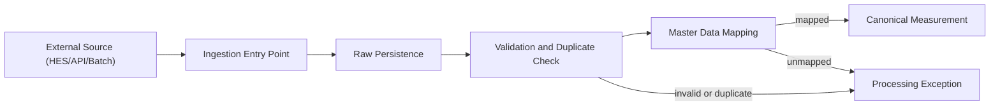

# Architecture

## Design philosophy

The minimal system should be small in scope but not short-sighted in shape. The primary objective is to prove the core data pipeline while preserving architectural room for later VEE, usage, billing, and CIS work.

## Core architectural principles

### Pipeline first

- Prioritize trusted ingestion, preservation, mapping, and canonicalization over downstream billing logic.
- Treat raw data, canonical data, and operational exceptions as separate but linked concerns.

### Preserve source truth

- Raw reads and raw events are immutable operational records.
- Downstream processing must reference source records rather than overwrite them.

### Structure before feature

- New features must start with a structural assessment of the affected source code.
- If routes, services, models, or templates are too tightly coupled, unclear, or duplicated, refactor first.
- Refactoring is not optional when structural issues would make the new feature brittle or misleading.

### Explicit boundaries

- Web/UI logic should remain separate from business processing logic.
- Business processing logic should remain separate from infrastructure concerns such as database adapters or external system clients.
- Integration-specific concerns should be isolated behind narrow service or adapter boundaries.

### Design for integration

- The minimal architecture must assume real HES connectivity later.
- Persistence and service boundaries should remain compatible with future PostgreSQL deployment, external APIs, and background processing.

### Design for localization

- User-facing text must be treated as content requiring localization.
- The architecture should prefer message keys or translation hooks over direct hard-coded strings for future UI and API error messaging.

## Logical layers

### Presentation layer

- Flask blueprints
- Jinja templates
- Bootstrap-based operator UI
- Request validation and response formatting

### Application layer

- Use-case oriented service functions
- Ingestion orchestration
- Mapping coordination
- Exception registration

### Domain and persistence layer

- SQLAlchemy models
- Entity relationships
- Business state transitions such as `pending`, `mapped`, `duplicate`, and `exception`

### Integration layer

- External source adapters
- Database connectivity configuration
- Future API clients and worker execution boundaries

## Expected code organization

The current structure is a starting point. As the system grows, code should continue moving toward clear ownership by responsibility rather than by convenience.

- `app/blueprints/`: HTTP-facing entry points
- `app/services/`: use-case and orchestration logic
- `app/models.py`: persistent domain entities for the minimal stage
- `app/db.py`: shared persistence bootstrap
- `app/templates/` and `app/static/`: operator UI assets
- `docs/`: engineering and domain guidance

As complexity grows, the project should consider splitting `models.py` and adding dedicated integration modules such as `app/integrations/` or `app/repositories/`.

## Data flow

## Refactoring triggers

The team should perform structural improvement before adding new features when any of the following are true:

- Route handlers begin to contain business logic directly.
- Similar logic is duplicated across endpoints or templates.
- A module is responsible for unrelated concerns.
- A change would require touching many unrelated files because boundaries are unclear.
- External integration logic starts leaking into UI or domain code.
- Localization concerns require searching for scattered hard-coded strings.

## External integration considerations

### Database

- Local development may continue with SQLite for speed.
- Schema and access patterns must stay compatible with PostgreSQL as the likely operational target.
- Future partitioning and high-volume storage concerns must not be blocked by early schema shortcuts.

### API and upstream sources

- HES-specific payload contracts should be versioned and isolated.
- The system should assume missing fields, duplicate delivery, retries, and inconsistent upstream timing.
- Future connectors should be added through service or adapter boundaries rather than embedding source-specific parsing throughout the codebase.

## Internationalization considerations

- User-facing pages should be designed so labels and notices can be translated into English and Korean.
- API error responses should be designed so they can later expose localized messages while retaining stable machine-readable codes.
- New features should avoid binding business rules to one-language-only template strings.

