# MDMS Preproduct Menu Map

## Purpose

This document records the current menu composition of the implemented
`mdms-preproduct` web UI.

It is intended to help with:

- operator onboarding
- training material review
- screenshot pack review
- future navigation changes

The current source of truth is
[base.html](/home/tprover/2604_sim_mdms_auto/app/templates/base.html).

Unless otherwise noted, the labels below reflect the current Korean UI.

## Top Navigation Map

```mermaid
flowchart TD
    Root["MDMS 최소 단계 웹 메뉴"]

    Root --> Dashboard["대시보드"]
    Root --> Vee["VEE 예외"]
    Root --> Replay["VEE 재평가 요청"]
    Root --> Export["청구 내보내기"]
    Root --> Hes["HES"]
    Root --> Master["마스터 데이터"]
    Root --> Events["운영 이벤트"]

    Root --> Measurement["계측"]
    Measurement --> Ingest["적재 배치"]
    Measurement --> RawReads["원시 검침"]
    Measurement --> RawEvents["원시 이벤트"]
    Measurement --> Canonical["표준 계측"]
    Measurement --> Final["최종 계측"]

    Root --> Billing["정산"]
    Billing --> Usage["사용량"]
    Billing --> Determinants["청구 결정값"]
    Billing --> Charges["청구 금액"]

    Root --> Corrections["보정"]
    Corrections --> Estimation["추정 감사"]
    Corrections --> ManualEdit["수동 보정"]
    Corrections --> Exceptions["오류 큐"]

    Root --> Runtime["운영"]
    Runtime --> Adapters["어댑터"]

    Root --> Utility["공통 유틸리티"]
    Utility --> Language["언어 전환"]
    Utility --> SignIn["로그인 상태 표시"]
    Utility --> LoginOut["로그인 / 로그아웃"]
```

## Top-Level Navigation

### Primary links

| Label | Route | Main purpose |
| --- | --- | --- |
| `대시보드` | `/` | Daily opening screen and overall operating summary |
| `VEE 예외` | `/vee-exceptions` | Exception triage queue |
| `VEE 재평가 요청` | `/vee-replay-requests` | Replay request list and monitoring |
| `청구 내보내기` | `/billing-export-requests` | Export request list and monitoring |
| `HES` | `/hes-systems` | HES system list and detail entry |
| `마스터 데이터` | `/master-data` | Master-data registration and review |
| `운영 이벤트` | `/operational-events` | Operational timeline and accountability review |

### Grouped dropdowns

#### `계측`

| Label | Route | Main purpose |
| --- | --- | --- |
| `적재 배치` | `/ingest-batches` | Ingest batch visibility |
| `원시 검침` | `/raw-reads` | Raw read visibility |
| `원시 이벤트` | `/raw-events` | Raw event visibility |
| `표준 계측` | `/canonical-measurements` | Canonical measurement visibility |
| `최종 계측` | `/final-measurements` | Final measurement visibility |

#### `정산`

| Label | Route | Main purpose |
| --- | --- | --- |
| `사용량` | `/usage-transactions` | Usage recalculation results |
| `청구 결정값` | `/bill-determinants` | Billing determinant visibility |
| `청구 금액` | `/bill-charges` | Bill charge visibility |

#### `보정`

| Label | Route | Main purpose |
| --- | --- | --- |
| `추정 감사` | `/estimation-audits` | Estimation audit visibility |
| `수동 보정` | `/manual-edit-audits` | Manual-edit audit visibility |
| `오류 큐` | `/exceptions` | Legacy exception queue visibility |

#### `운영`

| Label | Route | Main purpose |
| --- | --- | --- |
| `어댑터` | `/adapters` | Adapter runtime list and detail entry |

## Contextual Drill-Down Screens

The screens below are part of the operating surface, but they are not entered
directly from the top navbar in the normal flow. They are usually reached by
opening a row from a list, queue, or dashboard card.

### Common drill-down detail screens

- `HES 상세`
- `어댑터 상세`
- `VEE 예외 상세`
- `추정 감사 상세`
- `수동 보정 감사 상세`
- `VEE 재평가 요청 상세`
- `청구 내보내기 요청 상세`
- `운영 이벤트 상세`
- `사용량 상세`
- `청구 결정값 상세`
- `청구 금액 상세`

### Why they are not top-level menu items

- They are normally opened from a selected row, not from a global landing page.
- They depend on object context such as `id`, `request_scope`, or linked
  lineage.
- Keeping them out of the top navbar reduces clutter and improves responsive
  behavior.

## Responsive Navigation Notes

The current navigation model is intentionally split into:

- short primary links for high-frequency operating flows
- grouped dropdowns for broader visibility surfaces
- a separate utility strip for locale, signed-in state, and logout

This is the current responsive behavior baseline:

- desktop
  - primary links and grouped dropdowns are visible in the navbar
- tablet and mobile
  - the full navigation collapses behind the navbar toggler
  - grouped dropdowns remain grouped after expansion

This means the current UI is not a flat long-link header anymore.
It is a compact primary navigation plus grouped secondary navigation.

## Related Operator Materials

- [mdms-preproduct-operator-manual.md](/home/tprover/2604_sim_mdms_auto/docs/mdms-preproduct-operator-manual.md)
- [mdms-preproduct-operator-slide-outline.md](/home/tprover/2604_sim_mdms_auto/docs/mdms-preproduct-operator-slide-outline.md)
- [mdms-preproduct-operator-screen-capture-checklist.md](/home/tprover/2604_sim_mdms_auto/docs/mdms-preproduct-operator-screen-capture-checklist.md)
- [02-dashboard-normal.png](/home/tprover/2604_sim_mdms_auto/docs/generated/screens/02-dashboard-normal.png)
- [mdms-preproduct-menu-map.pptx](/home/tprover/2604_sim_mdms_auto/docs/generated/mdms-preproduct-menu-map.pptx)
- [mdms-preproduct-operator-training-v2.pptx](/home/tprover/2604_sim_mdms_auto/docs/generated/mdms-preproduct-operator-training-v2.pptx)
