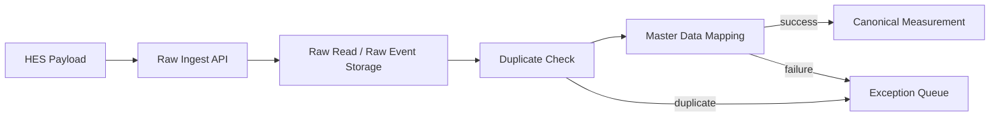

# Minimal E2E Plan

## Why start here

The first delivery target is not a full MDM product. It is the smallest believable operator flow that proves the following:

1. HES raw data can be accepted without loss.
2. Raw payloads can be mapped to internal master data.
3. Canonical measurements can be created from the mapped records.
4. Failures are visible in an exception queue instead of disappearing inside the pipeline.

That sequencing matches the earlier analysis: first build a trusted data pipeline, then add VEE and usage, then productize.

## Stack decision

### Chosen stack

- Python
- Flask
- SQLAlchemy
- Bootstrap

### Why this fits the minimal stage

- Flask keeps the application shape simple while the domain model is still moving.
- Jinja plus Bootstrap is enough for internal operator screens without frontend overhead.
- SQLAlchemy lets us keep the schema portable while leaving room to move from SQLite dev to PostgreSQL runtime.
- The team can get to a working raw-to-canonical flow quickly before introducing task queues, partitioning, and advanced rule engines.

## Phase boundary

This scaffold is intentionally limited to the `Minimal End-to-End Version`.

### In scope now

- Raw read ingest API
- Raw event ingest API
- Source metadata capture: `source_system`, `batch_id`, `received_at`, raw payload
- Minimal master data: `Device`, `ServicePoint`, `MeasuringComponent`, `InstallationHistory`
- Raw storage
- Canonical measurement creation
- Duplicate detection
- Mapping failure handling
- Exception queue visibility
- Operator dashboard and basic list screens

### Explicitly out of scope for this phase

- VEE rule engine
- Initial vs Final Measurement separation
- Estimation and editing
- Usage calculation
- Bill determinants
- Billing or CIS export
- Advanced audit and role model
- Batch orchestration and worker scaling

## Data flow

## Current data model

- `IngestionBatch`: stores source metadata and original request payload.
- `RawRead`: immutable incoming read record with canonical processing status.
- `RawEvent`: immutable event and alarm record.
- `ServicePoint`: minimal business location anchor.
- `Device`: external meter identity from source systems.
- `MeasuringComponent`: channel-level mapping target for canonicalization.
- `InstallationHistory`: placeholder for device movement and replacement history.
- `CanonicalMeasurement`: mapped output for downstream business logic.
- `ProcessingException`: queue for validation, duplicate, and mapping failures.

## Near-term implementation order

1. Lock the raw ingest contract with real HES sample payloads.
2. Decide whether local development should stay SQLite-only or add Docker PostgreSQL.
3. Expand the master-data UI so operators can load and correct mappings.
4. Introduce background workers for non-trivial ingest volume.
5. Add `Initial Measurement` and VEE status model.

## Architectural notes

- Raw records must be preserved even when invalid.
- Canonical records are created only after duplicate and mapping checks.
- Exceptions are treated as first-class operational data.
- The codebase already separates web, API, and service logic so background processing can be introduced without rewriting the Flask surface.

